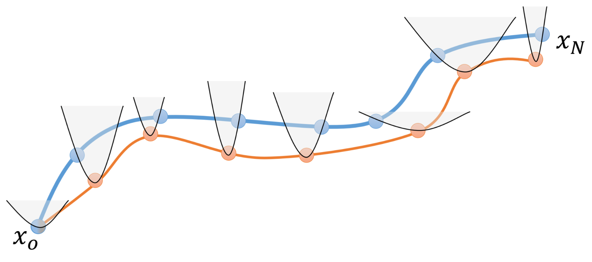
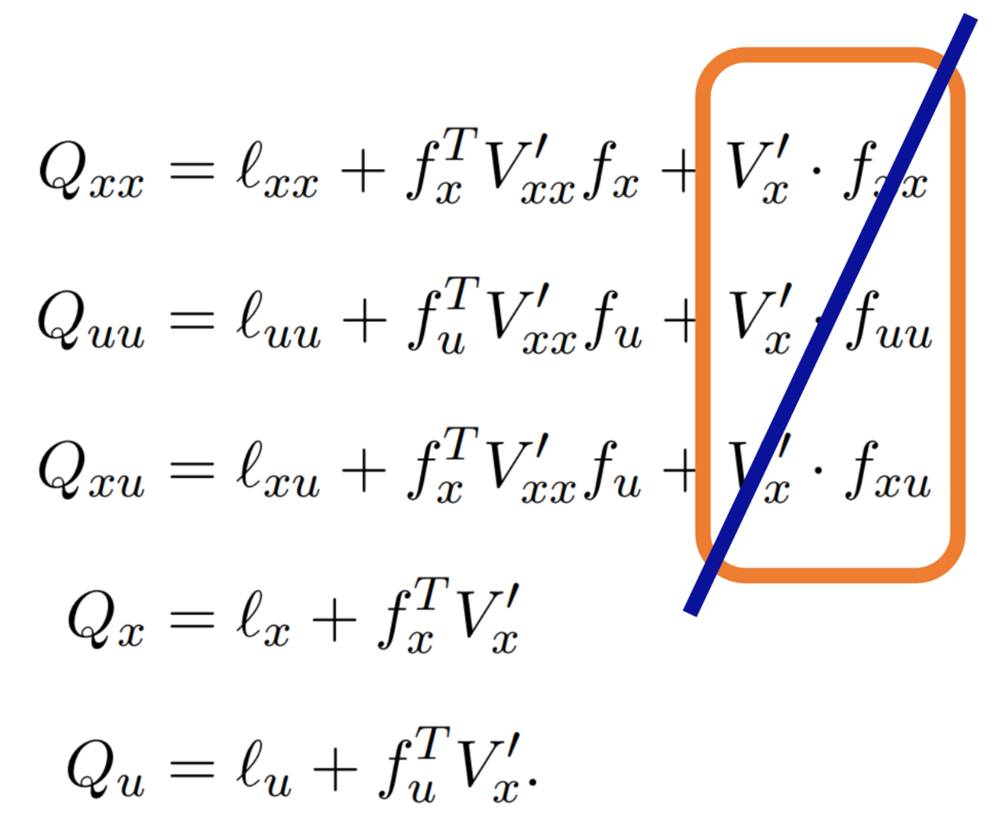
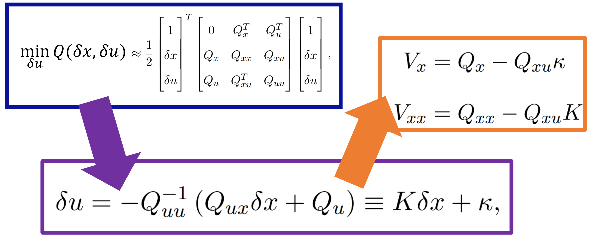
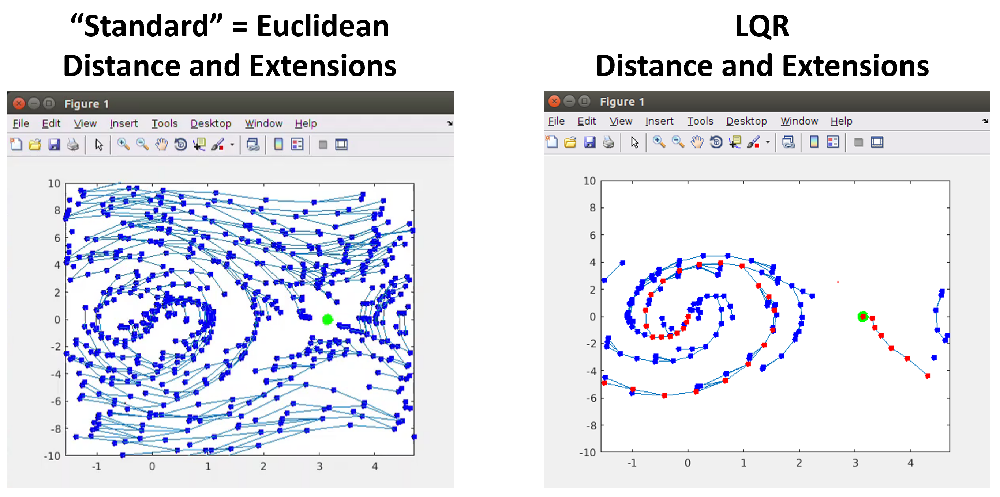

# COMS BC 3997 - F22
# PS3: (Trajectory) Optimization and Machine Learning
* Written Due: 11:59pm, Monday October 24th
* Coding Due: 11:59pm, Monday October 31st

In this assignment, you will implement the DDP algorithm as well as build on your RRT code from PS1 to implement LQR-RRT for dynamical systems. You will also explore these topics (and their mathematical underpinnings) in more detail through the written assignment -- as well as cover some ML concepts that didn't make it onto the last assignment.

# Written Assignment (23 points)
## Written Due: 11:59pm, Monday October 24th

Please go to the PDF in the written folder for the written instructions.

Problem 1: Configuration Space (2 points)

Problem 2: (Optimal) Control (5 points)

Problem 3: Machine Learning - Linear Models (5 points)

Problem 4: Machine Learning - Nonlinear Models (4 points)

Problem 5: Convex Optimization (7 Points)

# Coding Assignment (17 points)
## Coding Due: 11:59pm, Monday October 31st
**You must submit to gradescope to get credit for the assignment --- make sure you submit the required files before the deadline!**

**NOTE: You need to install pygame for the visuals to run: `pip3 install pygame`**

**NOTE2: You need to install the python control library (unless you want to implement LQR completely by hand): `pip3 install control`**

## DDP Algorithm (9 points)

In this section, you'll be implementing the DDP algorithm (in particular the iLQR variant). All code can be found in the `ddp` folder. Your goal will be to implement several functions in `util.py` to successfully optimize paths under a cost function.

**Files you'll want to read:**
`ddp.py` 		The main DDP loop
`pendulum.py` 	Defines a series of (very useful) helper functions related to the robot (the pendulum) we are working with.

**Files you'll edit (and thus submit to Gradescope for Autograding):**

`util.py` 	Where all of your DDP helper functions will go.

### Part 1 - Computing the cost
Start by computing the running cost over all points along the trajectory. Make sure to take into account both the states and the controls. Hint: You may want to use the helper functions in the `Pendulum` class stored as `self.robot_object` (they do a lot of nice things for you)!

Functions that should be filled in for full credit in the `util.py` file are:
* `compute_total_cost`     - 1 point

### Part 2 - The Backward Pass
Next we will compute the feedback control update along the backward pass. We start with `initialize_CTG` aka setting up the initial quadratic approximation of the cost-to-go (aka negative reward / value function) at the final state. Hint: You again may want to use the helper functions in the `Pendulum` class stored as `self.robot_object` (they do a lot of nice things for you)!

The `ddp.py` main loop will then iterate along the trajectory for you. Your job will then be to compute the various terms used during each pass of the loop. You will first want to compute the quadratic approximation of the cost and dynamics at each state (`compute_approximation`) again using the `self.robot_object` helper functions. Those approximations will then be used to backpropogate the cost-to-go (aka negative reward / value function) through the dynamics approximation and account for the running cost as well (`backpropogate_CTG`). You'll want to use the iLQR version of the math from the lecture slides (see image below). Also note that most things are numpy arrays and so the [np.matmul](https://numpy.org/doc/stable/reference/generated/numpy.matmul.html) function will make your life a lot easier!

Following that you'll need to use those outputs to construct K, du, and the new estimate of the cost-to-go Vxx, Vx using the math from the lecture slides (see image below) and again most things are numpy arrays!

Functions that should be filled in for full credit in the `util.py` file are:
* `initialize_CTG`		   - 1 point
* `compute_approximation`  - 1 point
* `backpropogate_CTG`      - 2 points
* `compute_du_K`           - 1 point
* `compute_new_CTG`        - 1 point

### Part 3 - The Forward Pass
Finally, you'll want to compute the control updates in the forward pass based on the feedback controller you computed in the backward pass. The `ddp.py` main loop will iterate along the trajectory for you. What you need to do is compute the change in each control we want to apply at each state. Remember that we have both a feedforward (du) term and a feedback (K) term. You'll also want to implement the line search version of the control update!

Functions that should be filled in for full credit in the `util.py` file are:
* `compute_control_update` - 2 points

### Part 4 - Explore
Now that you have a working DDP implementation run the `runPend.py` file. What happens? Does the trajectory go all the way to the goal? If you change the parameters for the cost function by adjusting `Q` and `R` in that file what happens? Play around with it a little bit. Hopefully it will give you a little better intuition for what the math is doing!

## LQR-RRT Algorithm (8 points)

In this section, you'll be implementing the LQR-RRT variant of the RRT function. All code can be found in the `rrt` folder. Your goal will be to implement several functions in `util.py` to successfully find a valid path for a dynamical system (a pendulum).

**Files you'll want to read:**
`rrt.py` 		You will recognize this as almost identical to the file from PS1
`pendulum.py` 	You will recoginize this as very similar to the `pendulum.py` file from the DDP section -- it just constains a few different (very useful) helper functions related to LQR.

**Files you'll edit (and thus submit to Gradescope for Autograding):**

`util.py` 	Where all of your LQR-RRT helper functions will go.

### Part 1 - PS1 Redux
We need to start by re-implementing a bunch of functions that we implemented in PS1. Some are identical, and others have a slightly genericized format in order to adapt to the dynamical system setting. Do feel free to copy and paste from PS1. If you didn't create a distance function in PS1 we are going to do that this time as we will swap in the LQR distance later and so we first need a `distance_euclidean`. We will then use the generic distance function to help us decide on the `winCondition` (identical to PS1) and then we will abstract the getNewPoint function from PS1 as I had to do some funky stuff to get the graphics to work right and so you'll just need to implement the `sampleGoal` function to decide whether or not to explore or exploit. Finally, you'll need to use the generic distance function to find the `nearestNode` to each sampled point (should remain mostly identical to PS1).

Functions that should be filled in for full credit are:
* `distance_euclidean`  - 1 point
* `winCondition`    	- 0.5 points
* `sampleGoal`    		- 0.5 points
* `nearestNode`     	- 1 point

### Part 2 - Naive Euclidean Controls
You'll now need to implement the naive euclidean effort to compute the best control to extend toward our nearest point. You'll do this by brute force trying a set of possible controls and picking the best one. Your generic distance function and the `get_valid_controls` functions will be helpful.

Functions that should be filled in for full credit are:
* `compute_control_euclidean` - 2 points

At this point you can run the `runPendEuclidean.py` to see RRT try its best to get to the goal. While each sample is fast, it will likely take MANY samples to reach the goal. That said, sometimes you'll get really lucky and find it quickly!

### Part 3 - LQR Costs and Controls
Finally we'll implement the LQR costs and controls in order to efficiently find paths for our dynamical system. We'll start by computing our distance metric (`distance_LQR`). You'll want to use the helper function `compute_LQR` in the `Pendulum` (stored as `self.robot_object`) to avoid having to do all of the math yourself! You'll then want to compute the control which again will be made much easier by using the `compute_LQR` helper function.

Functions that should be filled in for full credit are:
* `distance_LQR`		- 2 points
* `compute_control_LQR`	- 2 points

At this point you can run the `runPendLQR.py` to see the power of using the LQR metric! While each sample will tkae more time, it will likely take very few samples to reach the goal. That said, sometimes you'll get really unlucky and it still may take a while. That's random search for you!

### Part 4 - Explore
The `rrt.py` file has a few default hyperparameters that can greatly impact the relative merit of the LQR metric. In particular changing the `WIN_RADIUS` or the `GOAL_PROB` can really help (or hurt) the euclidean metric. Try changing things around a little and see what you find! Can you make euclidean generally preform as well as LQR in terms of total run time? Can you make it better?
